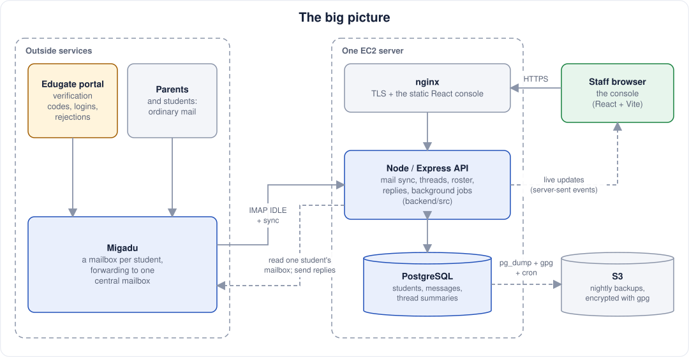
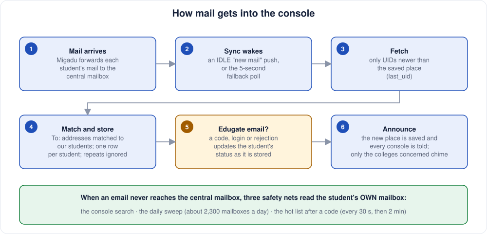
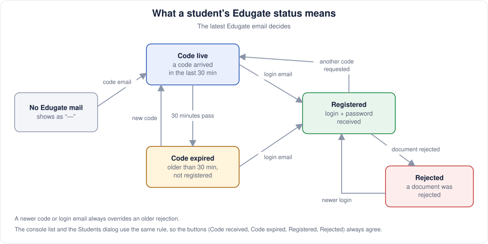
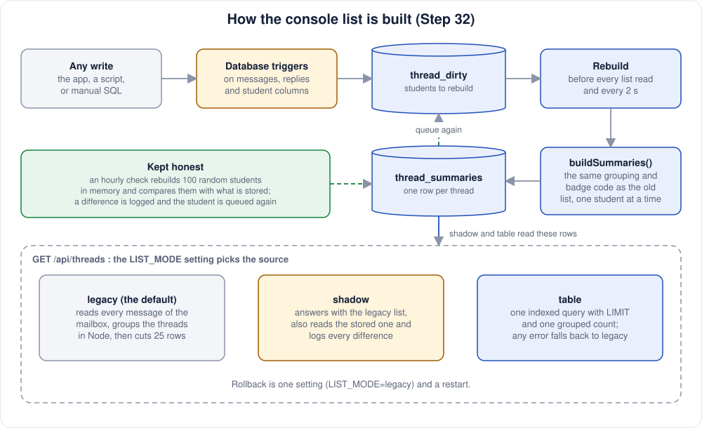
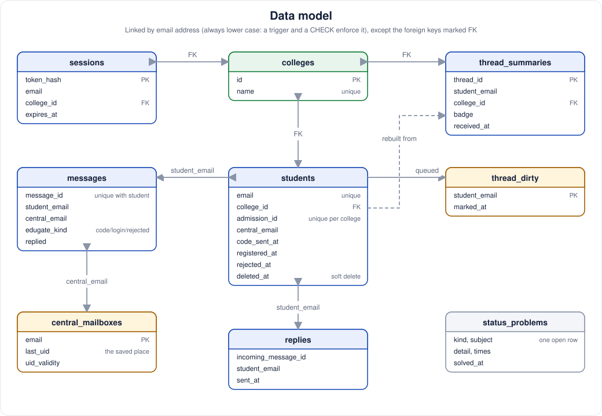
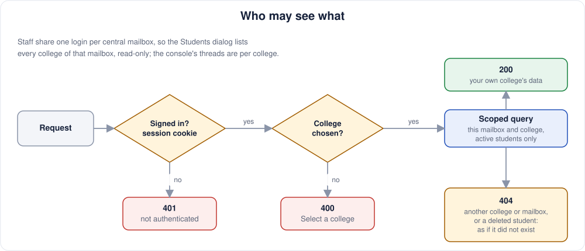
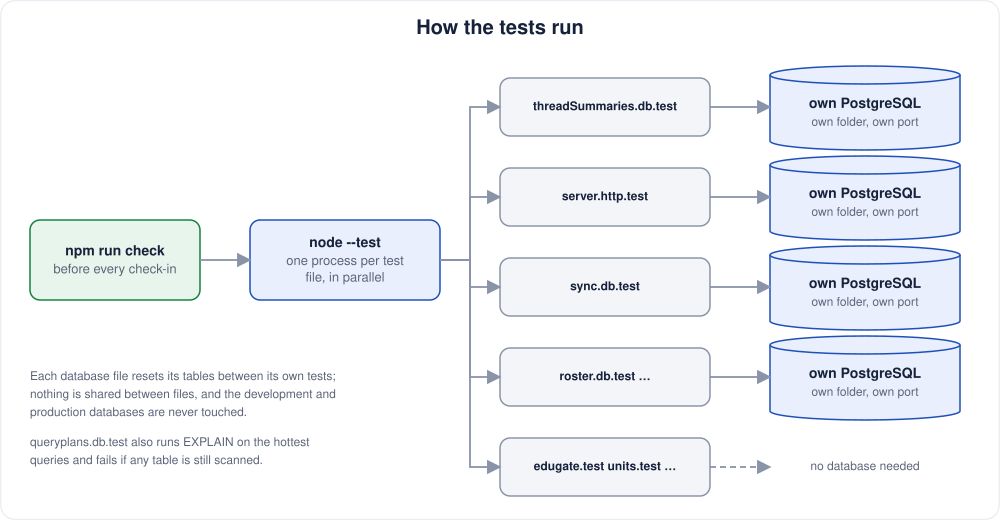

# Student Mail Console

A web console for the staff who handle the mail of about 2,300 students across three colleges
(**KSMA CENTRAL**, **IHSM CENTRAL**, **IHSM ELITE**). Every student has a mailbox at
`myemailinfo.com` (hosted by Migadu) that forwards to one *central* mailbox. The console reads
the central mailbox and shows each student's mail as threads. Staff copy the verification codes
and login details that the Edugate admission portal sends, reply to parents, and add students.

> [`PROJECT.md`](PROJECT.md) has the project history, decisions, and current test notes.
> Diagrams showing stored thread summaries and database test tooling describe the
> planned Steps 31–33; those features are not in this checkout yet.

## The big picture



## How mail gets into the console



## What a student's Edugate status means



## How the console list is built

The current list reads *every message* of the mailbox, groups messages into threads in Node,
and then cuts out 25 rows. Planned Step 32 stores each student's thread summaries so list loads
can use an indexed query. The diagram shows that planned design and its fallback setting.



## Searching for a student

Both search bars (the console and the Students dialog) split what you type into words, and every
word must match somewhere in the student's name, email, college or admission ID. Order does not
matter, words can be partial, and case is ignored, so `MOHD KHAN`, `khan farman mohd` and
`farma moh kha` all find MOHD FARMAN KHAN. The shared code is `backend/src/searchTerms.ts`.

## Data model



## Who may see what



## The tests



The suite uses Node's test runner. Migration and roster tests start a throwaway PostgreSQL;
Step 33 expands that approach to the backend and adds an `EXPLAIN` test for the hottest queries.
The diagram shows the planned expanded test setup.

## Checks

The current checkout has no root `npm run check` command yet. Run these from the repository
root; Step 33 adds a single command and the coverage, mutation, and load-test scripts.

```bash
npm --prefix backend test
cd backend && npx tsc --noEmit && cd ..
npm --prefix frontend run build
```

## Running it locally

```bash
# 1. PostgreSQL with the schema
psql -f backend/schema.sql            # into an empty database (see PROJECT.md for the role and .env)

# 2. Backend (API on :3001)
cd backend && npm install && npx tsx src/server.ts

# 3. Frontend (Vite dev server)
cd frontend && npm install && npm run dev
```

Settings live in `backend/.env` (not committed; see `backend/.env.example`). The planned
stored-list implementation adds `LIST_MODE` and `THREAD_WORKER`.

## Glossary

| Term | Meaning |
|---|---|
| Central mailbox | The one Migadu mailbox (`central.ksma@myemailinfo.com`) that every student mailbox forwards to. Staff log in with it. |
| College | One of `KSMA CENTRAL`, `IHSM CENTRAL`, `IHSM ELITE`. Staff pick one after login and see only its students. |
| Student mailbox | A student's own Migadu mailbox, checked directly when mail is late (Migadu can hold mail for hours). |
| Edugate | The registration site the students apply through. Its emails (code, login, rejection) drive the status. |
| Code | The one-time code Edugate emails; live for 30 minutes, then expired. |
| Login / registered | The Edugate email carrying the student's login and password, which ends the wait. |
| Rejected | An Edugate rejection email for the student. |
| Hot list | Students who just got a code; their mailbox is polled every 30 s, then 120 s, until registered or 35 minutes after the code. |
| Sweep | The rolling daily check of every student's own inbox (5 mailboxes per batch). |
| `used` badge | An older code that a newer code replaced; shown only when searching. |
| Thread | One student's messages grouped by Message-ID and replies. Threads never span students. |
| SSE | The live-update stream (`/api/events`) that tells open consoles to refresh. |

## Development gotchas

- The dev PostgreSQL runs on port 5433; production uses PostgreSQL 18 on the server, the dev
  database is 16. The database tests start their own throwaway PostgreSQL servers.
- Starting the dev backend logs in to the real Migadu mailboxes. To try backend functions without
  that, call them from a script against the dev database.
- A temporary `tsx` script must live inside `backend/` (it needs `backend/node_modules`); top-level
  `await` needs an `.mts` file. Delete it afterwards.
- `backend/coverage/` and `backend/reports/` are generated output. They are hidden on the dev
  machine through the local `.git/info/exclude`, not `.gitignore`; on a fresh clone add them there
  so a "stage all" does not sweep them into a commit.
- Backend changes need a restart of the dev server; Vite hot-reloads the frontend.
- A search runs a trigram index over name, email, central email, college and admission ID; the
  typed words are matched separately (`backend/src/searchTerms.ts`).

## Repository layout

```text
backend/
  src/            API, mail sync, thread building, roster, background jobs
  migrations/     numbered SQL migrations; 014–016 arrive with Steps 31–32
  schema.sql      full schema for a fresh install
  tests/          *.test.mjs and helpers/testdb.mjs for throwaway PostgreSQL
  scripts/        backup scripts; coverage, mutation, and load scripts arrive later
frontend/         React + Vite console
shared/           edugate.ts: the email templates, used by both sides
docs/diagrams/    the SVG diagrams above; generate.py redraws them
PROJECT.md        current state, step index, prod runbook, history, decisions
AGENTS.md         working rules for Claude, Codex and other agents (CLAUDE.md imports it)
```

The diagrams are plain SVG files. To change one, edit `docs/diagrams/generate.py` and run
`python3 docs/diagrams/generate.py`.

## Production

One EC2 instance runs Node, PostgreSQL and nginx. Code reaches the server only by `git push`
here and `git pull` there. A nightly `pg_dump`, encrypted with gpg, goes to S3. Nothing in this
repository should ever contain credentials or a database dump. The runbook (deploy steps, logs,
backups, rollback) is in `PROJECT.md` under "Operating prod"; the rules for agents are in
`AGENTS.md`.
